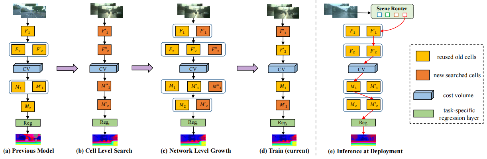

Code for *Continual Stereo Matching of Continuous Driving Scenes with Growing Architecture*, accepted as ORAL at CVPR 2022.

**Reusable Architecture Growth**


**Abstract**

The deep stereo models have achieved state-of-the-art performance on driving scenes, but they suffer from severe performance degradation when tested on unseen scenes. Although recent work has narrowed this performance gap through continuous online adaptation, this setup requires
continuous gradient updates at inference and can hardly deal with rapidly changing scenes. To address these challenges, we propose to perform continual stereo matching where a model is tasked to 1) continually learn new scenes, 2) overcome forgetting previously learned scenes, and 3)
continuously predict disparities at deployment. We achieve this goal by introducing a Reusable Architecture Growth (RAG) framework. RAG leverages task-specific neural unit search and architecture growth for continual learning of new scenes. During growth, it can maintain high reusability by reusing previous neural units while achieving good performance. A module named Scene Router is further introduced to adaptively select the scene-specific architecture path at inference. Experimental results demonstrate that our method achieves compelling performance in various types of challenging driving scenes.

If you use this code please cite:
```
@inproceedings{zhang2022continual,
title={Continual Stereo Matching of Continuous Driving Scenes with Growing Architecture},
author={Zhang, Chenghao and Tian, Kun and Fan, Bin and Meng, Gaofeng and Zhang, Zhaoxiang and Pan, Chunhong},
booktitle={Proc. IEEE Conf. Comput. Vis. Pattern Recognit. (CVPR)},
pages={18901--18910},
year={2022}}
```

## Requirements
```
python 3.7
PyTorch >= 1.1
torchvision >= 0.3
matplotlib
tensorboard
tensorboardX
scikit-image
opencv
```

## Code Structure

 - ./src/approaches: the reusable architecture growth framework
 - ./src/automl: neural units search and network level growth
 - ./src/dataloader: datasets preprocess and dataloader
 - ./src/filenames: dataset lists, e.g., four scenes with different weather
 - ./src/models: stereo models with Feature Net and Matching Net
 - ./src/utilstool: tool code for metrics
 - ./logs/: running logs
 
## Command to start experiment
```
sh run_rag.sh
```

## Acknowledgements
This repository makes liberal use of code from[ \[PSMNet\]](https://github.com/JiaRenChang/PSMNet),[ \[LEAStereo\]](https://github.com/XuelianCheng/LEAStereo),[ \[LLSEU\]](https://github.com/WenjinW/LLSEU).


